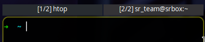

## Add group id in title

Use case: Using groups with disabled decorations, when window title showed in any panel

### BUGS

- When window closed not by **kill** or **killActivity** hyprland dispatcher, the title is not updated (e.g. closing terminal by ^D)
- Clients, what created before plugin loaded require the title changing, to add group id